第一回合武则天左移一格攻击中间狗狗

婴宁控最上面的狗狗下移一格攻击最下面的狗狗

韩信回归武则天继续上移

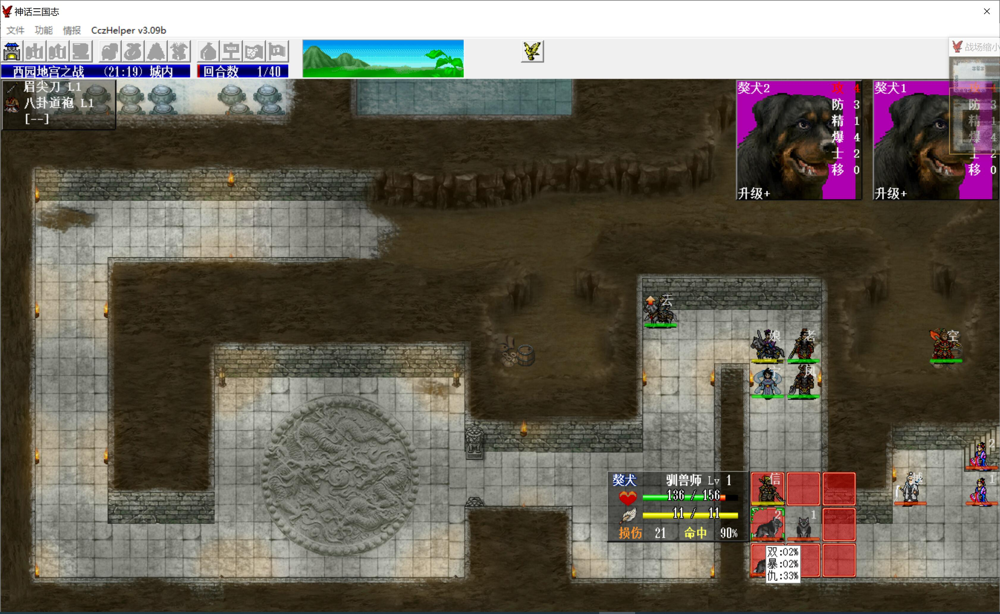

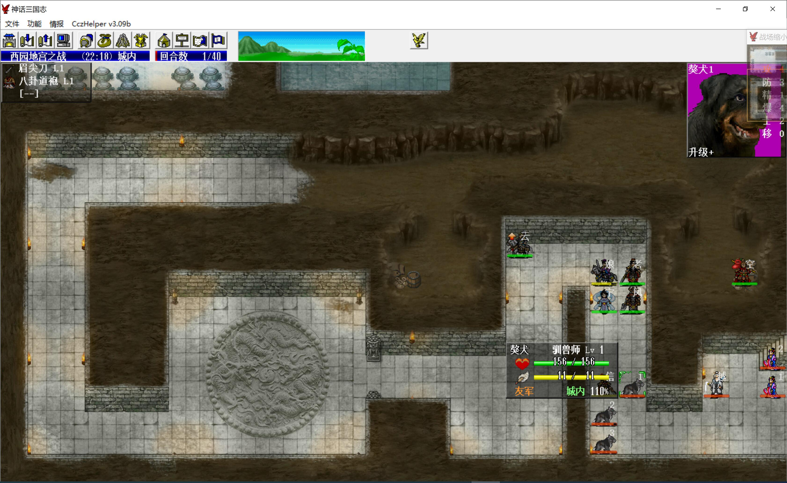

敌军回合狗狗被杀死

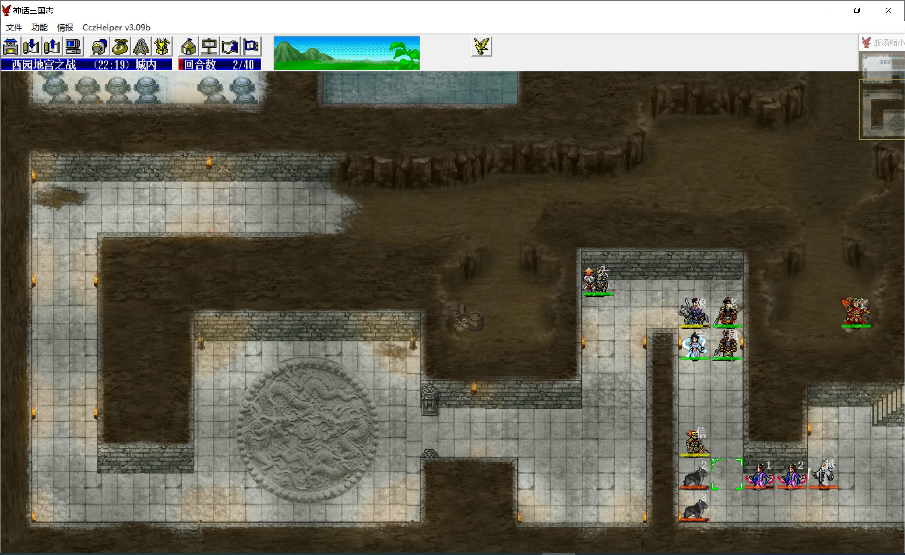

第二回合主角控王越穿死两个美人，武则天继续左移触发敌军，韩信打狗狗

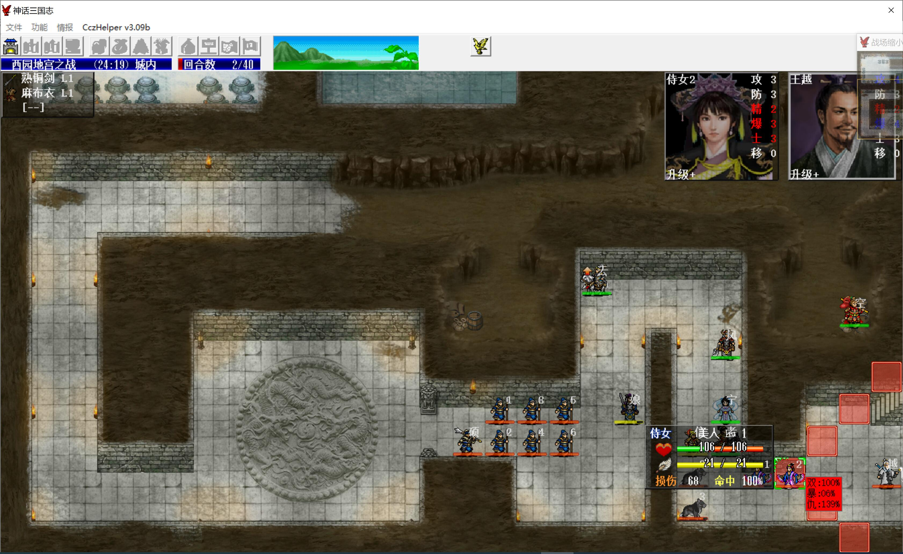

敌军回合狗狗都去打韩信（主角防高），两个步兵加骞硕正好可以打残武则天，武则天换血可以直接把一个步兵打到残血

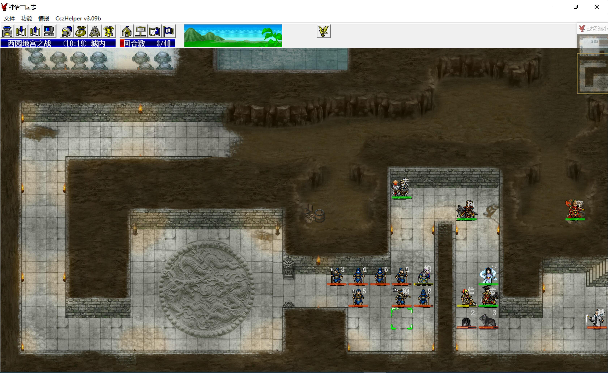

第三回合，王越再次穿死剩余两个狗狗（需要sl第一刀出个暴击，12%的概率），我军三人上移，潘凤下移吸引火力

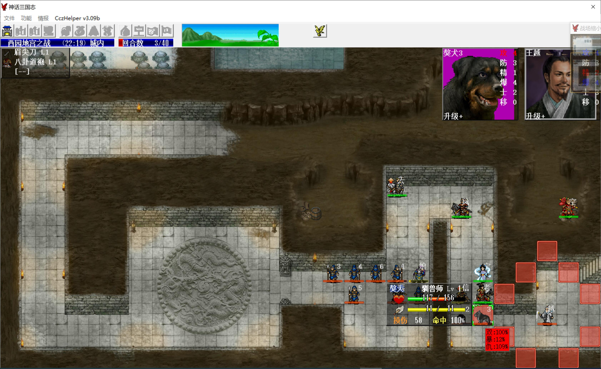

第四回合，婴宁吃药再控王越（不要让猴哥控，猴哥不是必须出手时都不要出手，否则等级压不住，后面只能仰仗猴哥的时候太多了），王越穿刺武斗兵，如此第一波伏军可以快速清掉

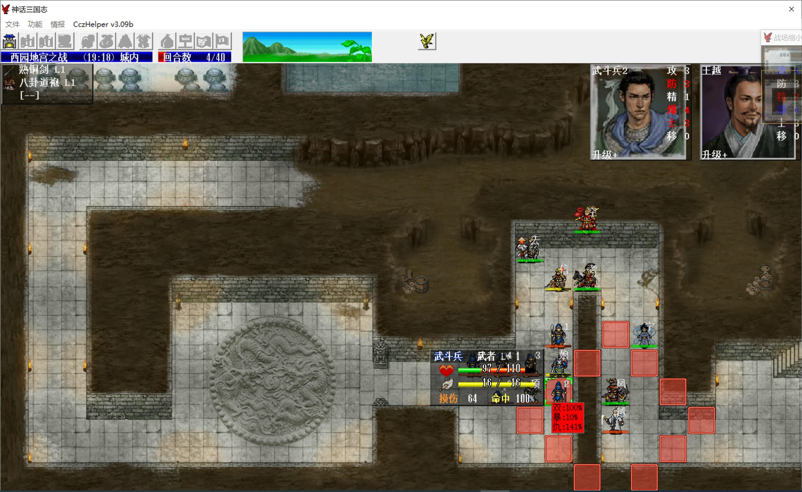

第二波伏军需要耐心慢慢杀，换血换步弓，反击杀近战，可以提高杀敌效率

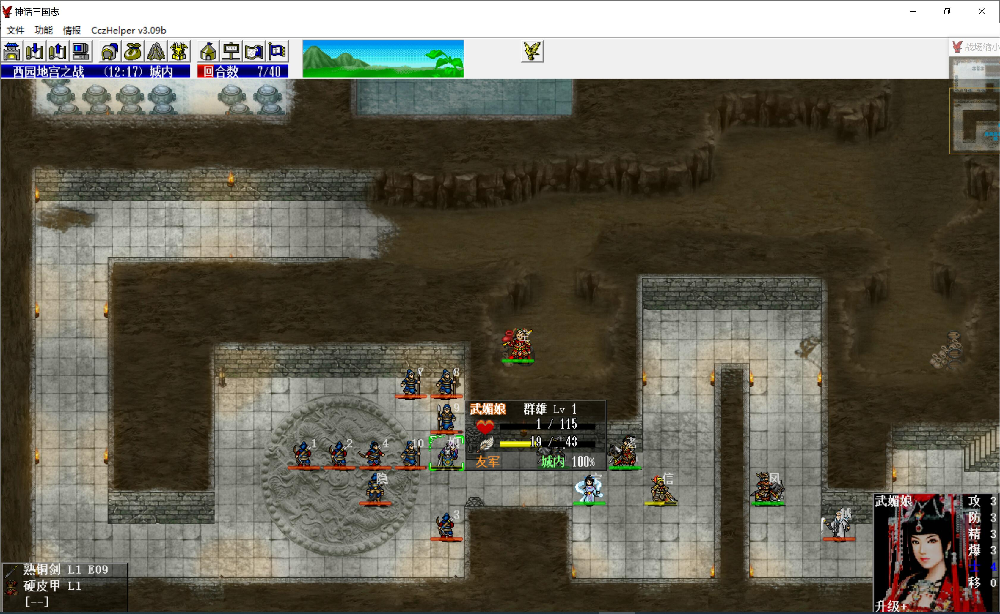

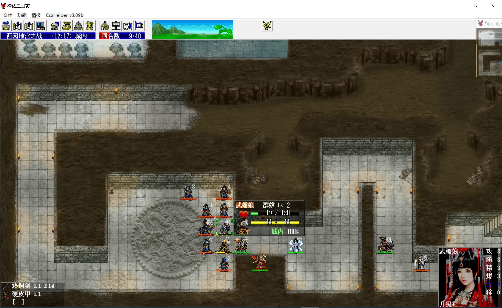

大概到第十二回合左右时，可以把第二波伏军清得差不多了，我军直接向前走，武则天、韩信断后卡位，且走且反击死剩余残血敌军

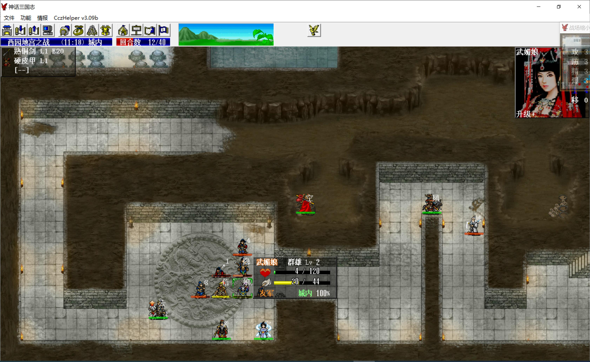

赵云荒地降移动，必要时可以让韩信回归赵云，让他快速上移到安全区，之后再让武则天触发第三波伏军

依然靠换血，另外韩信武则天都升了两级，普攻也比开始时高了一些，压力不大

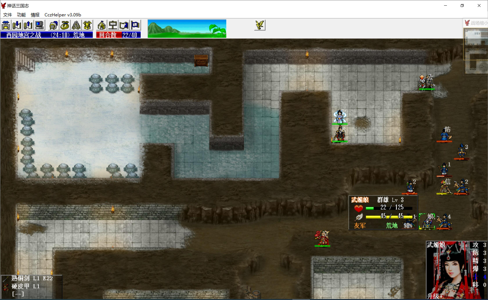

第四波曹操三人组很容易，三人正好可以把武则天打残，换血可以收了曹操，夏侯惇单挑退，就只剩夏侯渊了

赵云先去浅滩等着触发对话（他在浅滩降移动），多利用刺客练防具经验

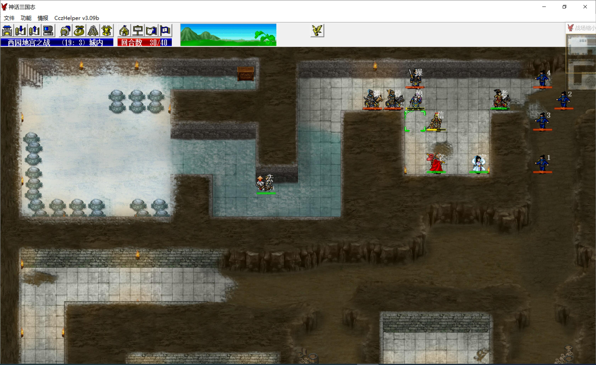

最后袁绍伏军也是靠换血，如果回合吃紧可以不打，武则天走到左上两格就过关了，最终本关只吃进3个心控经验（婴宁2个、主角1个）

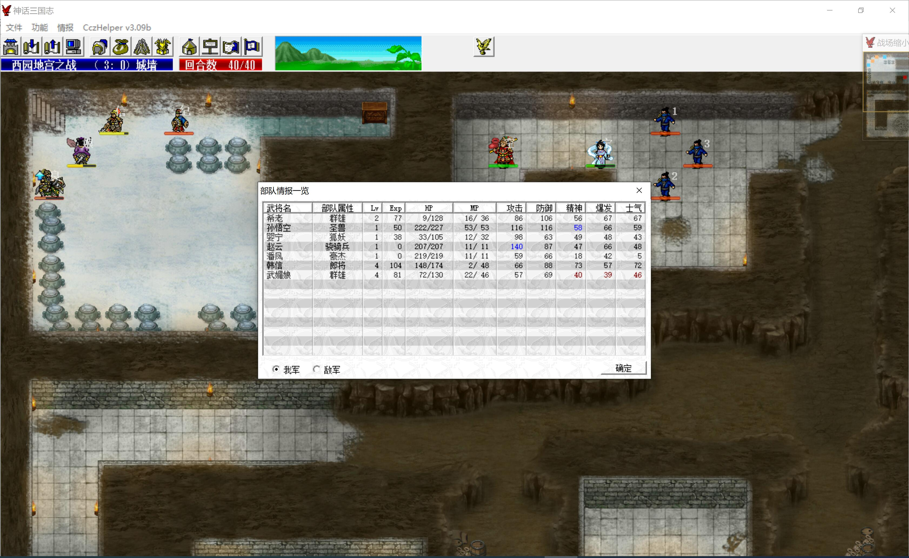

战后买紫绶仙衣
