第一回合，武则天下移让三个敌军反击残，潘凤和八戒注意走位，不要把剩下两个敌军引过来，猴哥一个人下去偷张角（不要腾云，腾云也是要经验的）

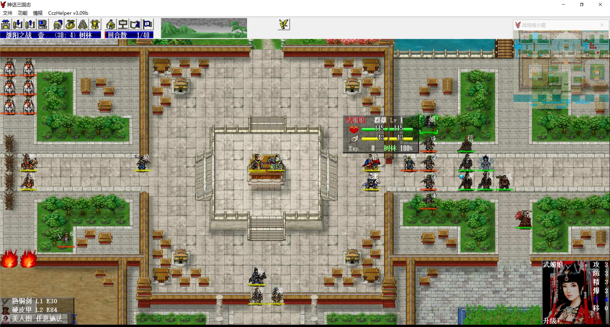

第二回合开始如图

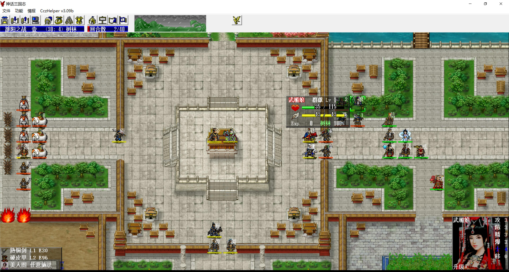

潘凤装倚天剑拉友军围攻可以杀死一个挡路敌军，吃进8点经验

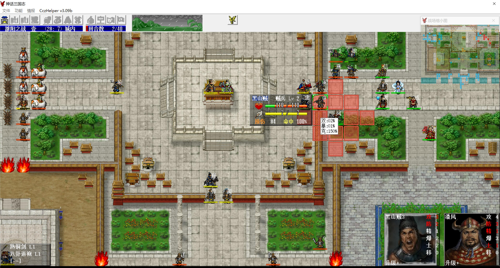

武则天换残另一个挡路敌军后，婴宁拉友军围攻可以将其击退，吃进8点经验

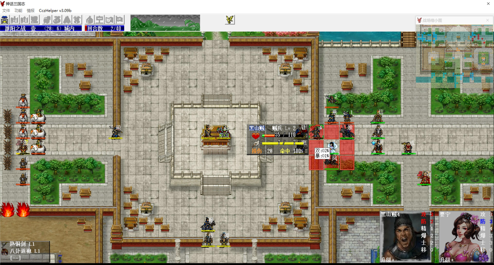

道路通畅后，主角快速进城

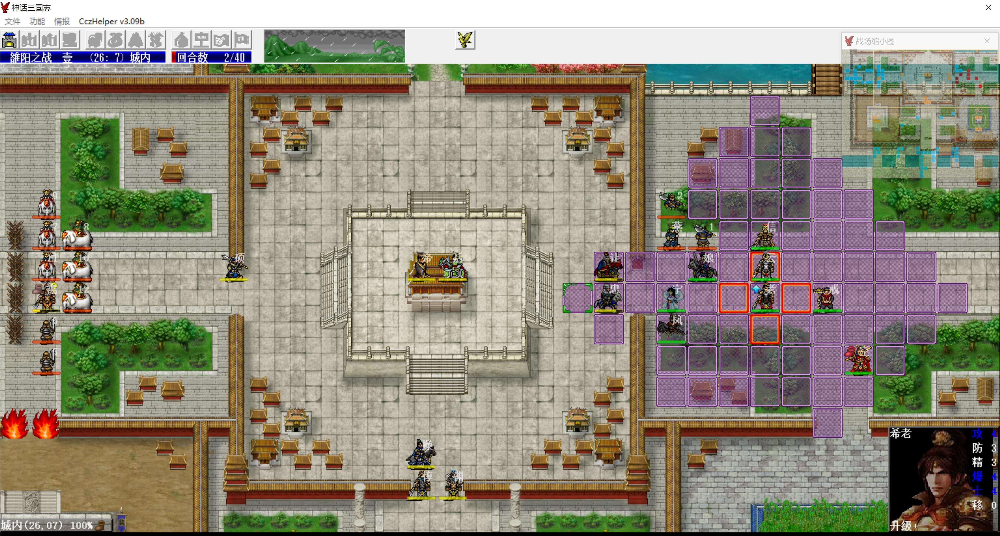

韩信回归主角，这样就可以在第三回合对话曹操，曹操三人组变可控

其他人也向城内方向移动，注意避开张燕的攻击范围，他不是无反攻击

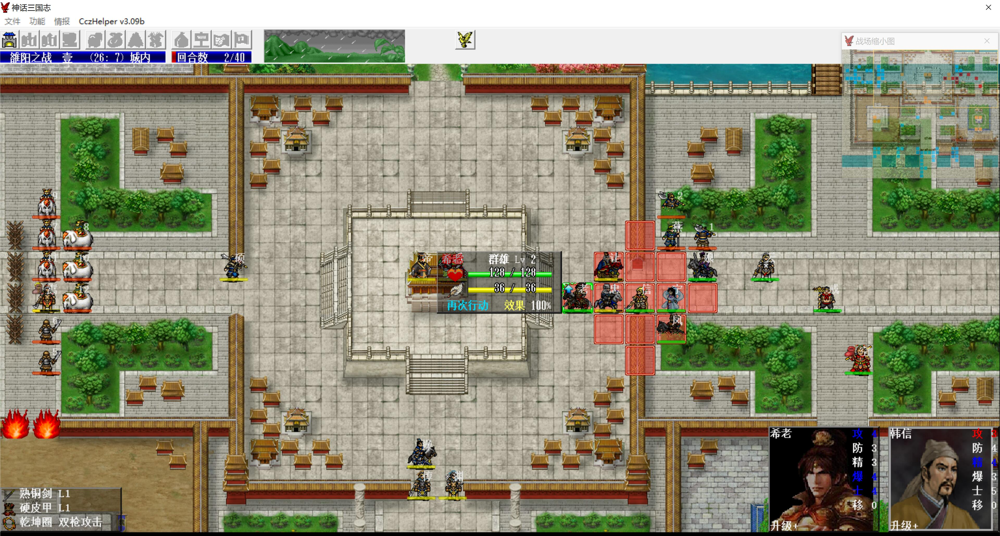

曹操走到夏侯渊的初始位置，这个位置不会被巨无霸攻击，夏侯兄弟上移到灵帝处帮忙对付左上来的敌军

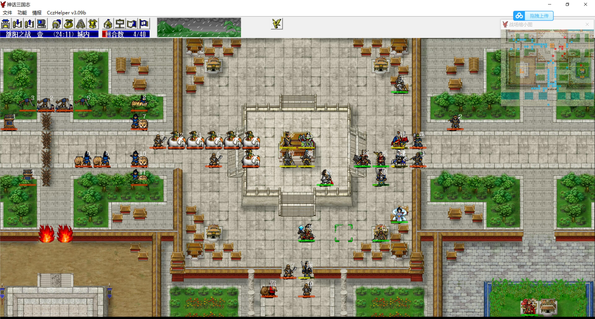

敌军回合，上路无压力，下路sl曹操倚天剑挡掉巨无霸的攻击（我军主动混乱巨无霸避免sl也行，但要吃进混乱经验，而且下一回合巨无霸自动就剧情混乱了，不划算）

第五回合，猴哥放大招，敌军全面瘫痪，趁此机会抓紧杀敌，尤其是威胁较大的象使

上路灵帝物理免疫、十字攻击、120%地形，夏侯兄弟不要攻击灵帝能攻击到的敌军，我军可输出的点不多，避免火力浪费

象使混乱攻击，但何皇后可以自动解，所以在击退全部象使前，一定要保住何皇后，需要sl左上角两个井阑混乱定身至少中一个，否则何皇后扛不住降防后的集火，其它敌军也不要恢复地太快，毕竟我军火力不足，象使和老虎清地差不多后，夏侯惇（远程免疫）就可以主动出击虐菜了

下路曹操每回合杀他左边的敌军，一刀一个，只要巨无霸混乱不解即可，残血了就让八戒喂药，下路的井阑靠八戒扛，虽然曹操反弹降防，但是被打了也还是有点疼的，必要时主角可以挡路（防高不会被打的）

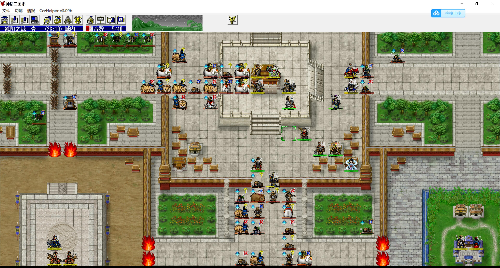

注意多留几个炮车练防具，没血了就去右边的兵营回血，然后再回来挨打

武则天和巨无霸的单挑（防御+10）没必要触发，武则天就是靠卖血换血混的，防高了就废了

赵云也不要早早对话巨无霸，后面还指望他全灭袁绍、何进呢，否则他们进城屠了炮车，我军的防具经验就没了，回合数也拖不满，六韬三略的经验也没了

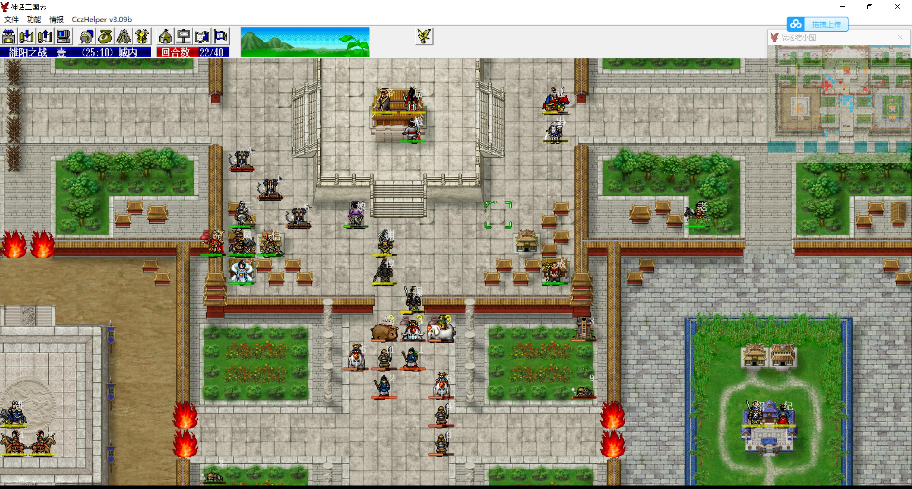

三十回合左右，敌军人数<15，袁绍、何进开始主动出击，任由他们被巨无霸全灭

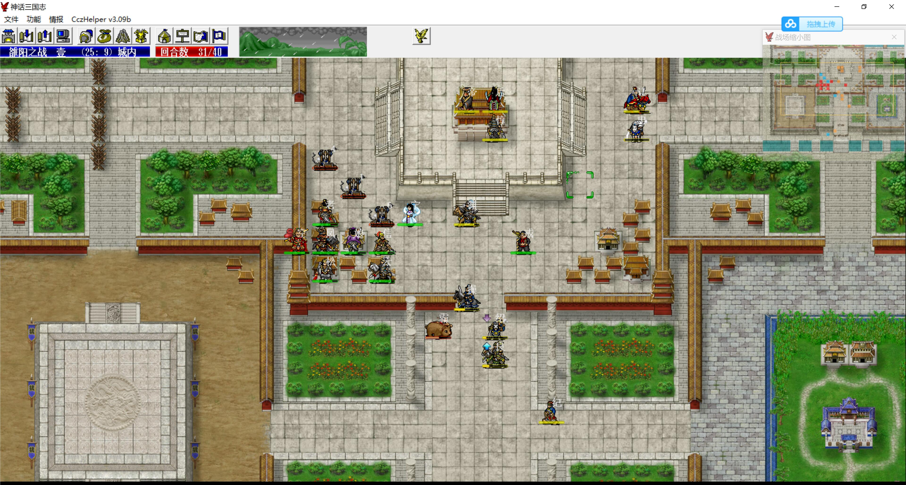

赵云对话巨无霸，曹操三人组将其击退，然后磨到最后一回合击退全部炮车

潘凤、婴宁各拉友军围攻一次，各得8点经验；韩信回归一次主角、武则天换血一次，各得14点经验；猴哥双击偷掉张角得48点经验，其他人不得经验

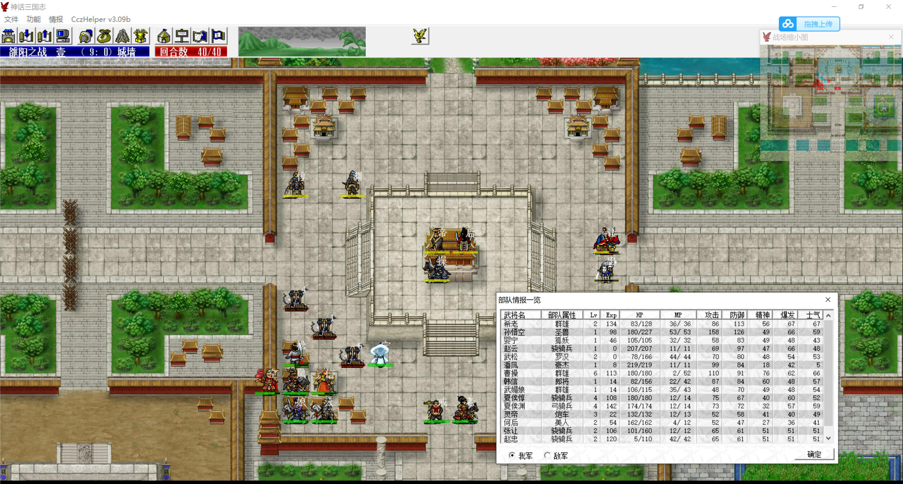