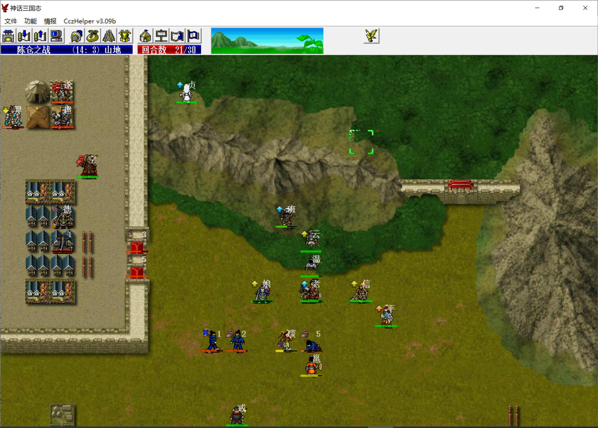

本关战后高长恭、赵飞燕加入，下关我军可以全军不升级，结束后武则天、韩信离队，因此本关可以让武则天开无双（鬼神枪+黄金甲+乾坤圈）吃进所有经验

目前我军14人共20级，因此本关只要升级人次<=7，都可以收到1级高长恭、赵飞燕

本关可以不带婴宁、武松，这样我军最高四人等级为3、2、1、1，平均<2，因此敌军默认等级依然为1级

潘凤和陈丽卿也可以不带，上去啥事也干不了，平白每回合消耗半个豆子

第一回合，武则天一人上行，八戒把马超定在武则天旁边，从而封死其他敌军过桥路

敌军阶段，除马云禄和庞德，其他人全部被击退

武则天被庞德反弹到只剩1血，鬼神之勇到极限，吃豆子回100，马超大招扣50，因此武则天的血量一直是1、51、101三个值

第二回合，武则天击退庞德，并在敌军回合反击退马云禄，白素贞右移接应蔡氏父女

第三回合，武则天击退最后的医生，这样就只剩马超了

八戒右移将马超引开，方便我军过桥

第四回合，武则天将马超换到101（马超豆甲加了100），蔡邕用法术攻击赫连勃勃

之后武则天一路沿河杀不去，注意黄金甲是没羽箭攻击，武则天每次都攻击隔一格的敌军，近身的可以靠反击杀死

赵云提前去右边触发单挑、消耗六个道士的mp（策略防御80%无压力）

白素贞和蔡文姬堵住赫连勃勃，蔡邕用法术慢慢耗死他，我军其他人各自吃豆

八戒也慢慢把马超引过去，最终在桥上取消他的地形优势，让残血武则天将其收掉

之后武则天继续清掉道士团，他们mp被赵云耗没了，会主动攻击武则天被反击死，然后再上行清掉马腾部

我军其他人去城门口触发剧情，之后在刺客团面前排队练防具

蔡氏父女慢慢耗刺客，被降防的刺客，蔡氏父女也是能打出点伤害的

城内最终大概率会剩韩遂、后羿、马超、庞德四个人，此时猴哥可以触发对话，只要穿个高级防具不用担心被打，韩遂防御不行，更嘲讽

韩遂全靠杏黄旗混，想让他死，只需sl马超连续两回合都攻击命中即可

庞德即便不被后羿射死，也会被无限复活的城门耗死

最终就只剩马超一人

武则天再次击退马超依然是先将马超换到100出头，然后和八戒站在一起等着敌军阶段被打残

马超的吸血只能吸十字中心的人，被溅射的伤害是吸不到的，而八戒必格挡，所以马超根本吸不到血

触发主角和马超的对话后，就可以击退马超了，最终击退剩余的刺客过关

本关武则天升了6级，赵云单挑5级阎行得64点经验，其他人不得经验

总升级人次为6，没有超过7，因此可以收到1级高长恭、赵飞燕

