高长恭的特技需要mp>=20，而1级高长恭只有13mp，因此需要手动改S剧本，将判断条件改成mp>=10

本关雷震子大招每回合扣50，自选武将只需带高长恭、八戒、婴宁（心控吕布、雷震子）、鲁大师（练装备）和白素贞

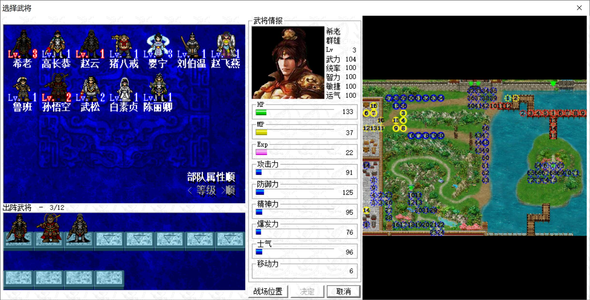

第一回合，马超顶住敌军输出，马云禄向后拉（太脆皮了）

我军全部左移，高长恭穿高级炎帝战甲断后，吕布一刀正好可以让他出特技

左上颜良、曹操、少帝如此站位即可，颜良自动加防、曹操倚天剑，少帝小潘凤，都死不了

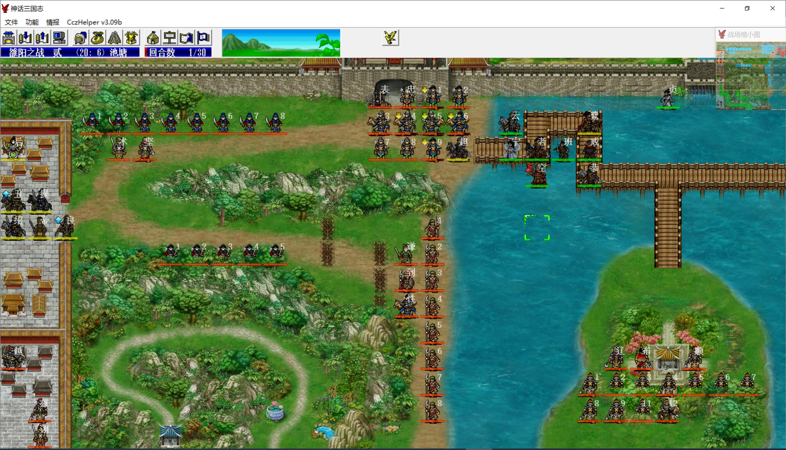

第二回合，婴宁心控吕布，卡住T型桥口，攻击张辽、高顺部

左上颜良曹操不用主动输出，吃豆保命即可，雷震子会来手动虐菜的

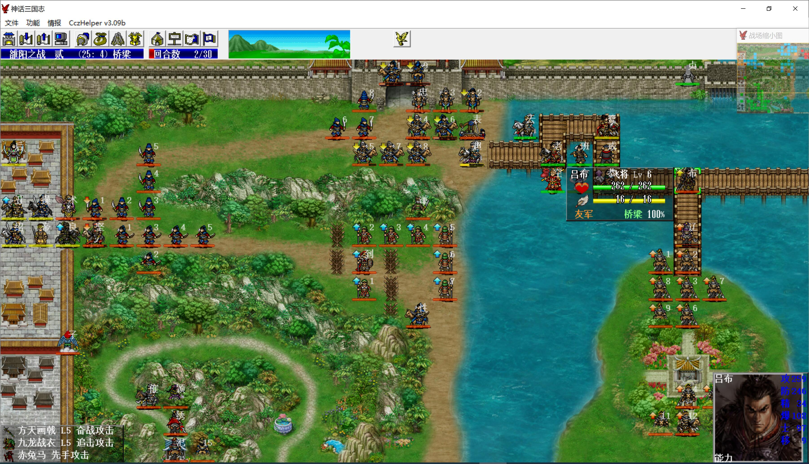

吕布变回敌军后，会成为陶谦、刘表的阵营，因此依然会和张辽、高顺部相互攻击

让八戒如下站位即可定住吕布，即便不心控他，也会全灭张辽、高顺部

马超尽量快速杀敌，一定要在雷震子全灭陶谦、陈到的丹阳军前，全灭刘表部，否则曹操那些人就要被他屠了

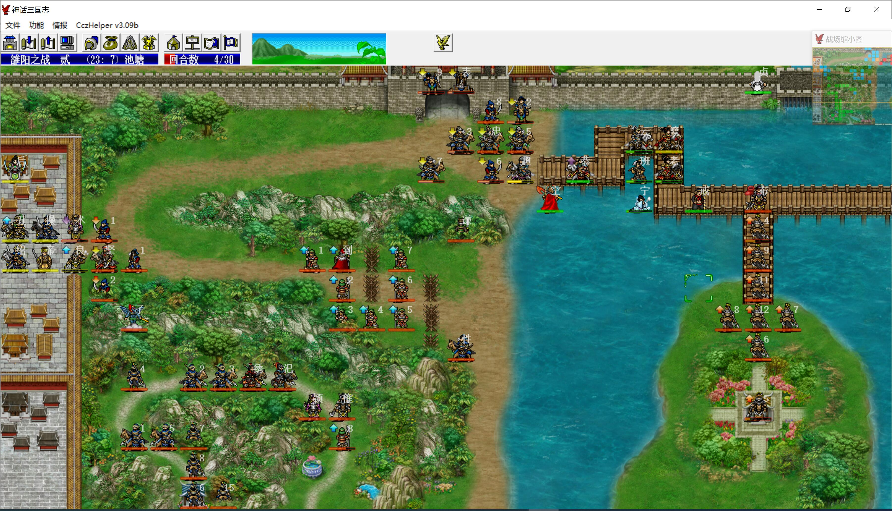

第七回合敌军阶段，雷震子击退了何皇后

第八回合猴哥、婴宁赶到，猴哥对话雷震子后，婴宁心控雷震子击退董卓

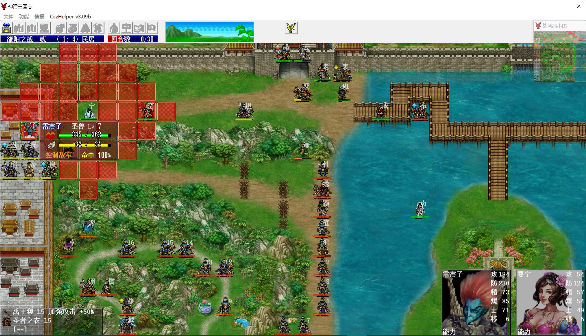

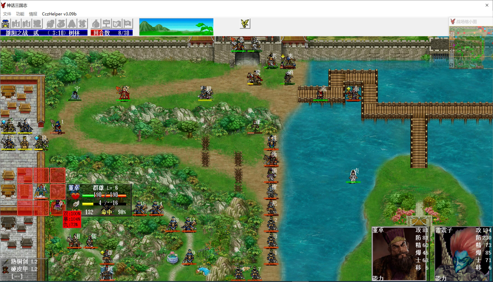

第九回合，雷震子再刷掉后羿

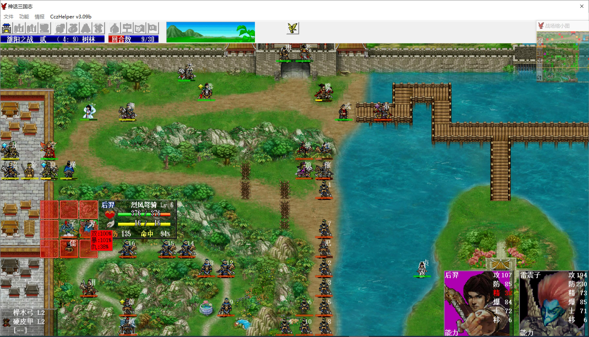

马超堵住路，赵云找机会触发和张绣的对话

八戒和邹月颖的单挑（爆发+20）没必要触发，没意义，而且还得得经验，影响压级，如果一定要触发，让少帝去接替八戒堵住吕布，八戒下来即可

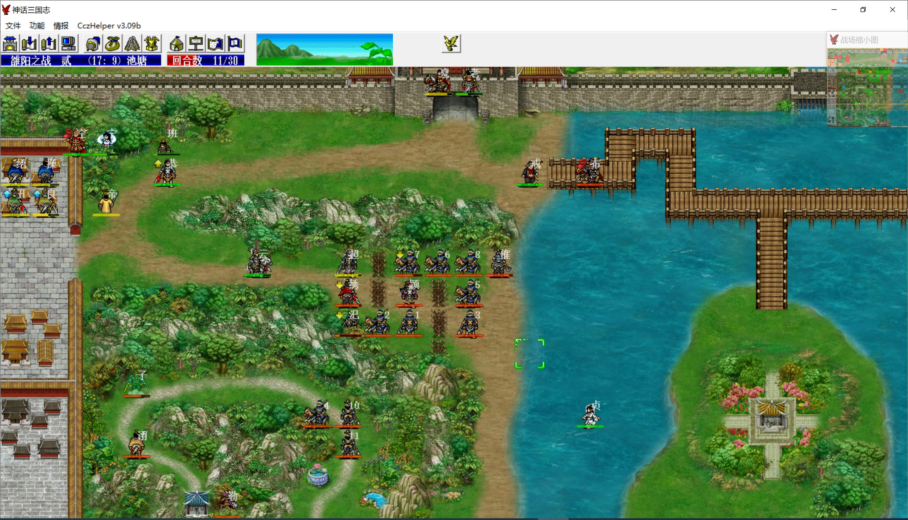

雷震子被董卓部围攻，sl李儒对他的毒一直不解，白素贞占住鹿寨，让他没有回复地形，待自动掉到个位数后被石勒收掉

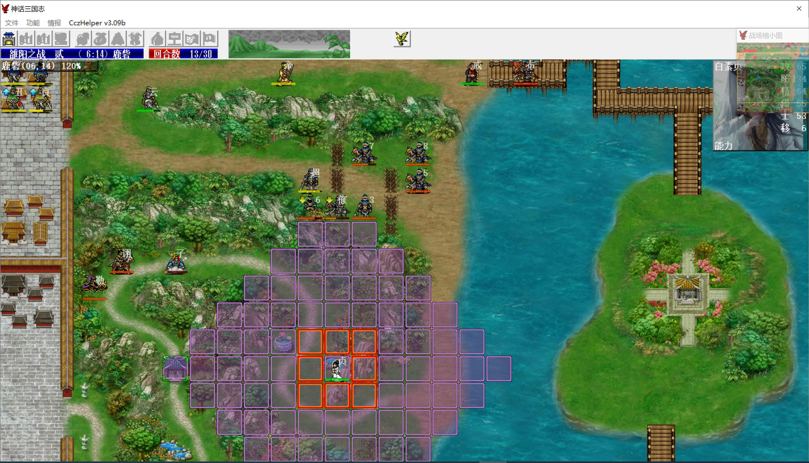

最后石勒上来后，把吕布也放过来，在倒数第二回合再次控他，在最后一回合击退石勒即可

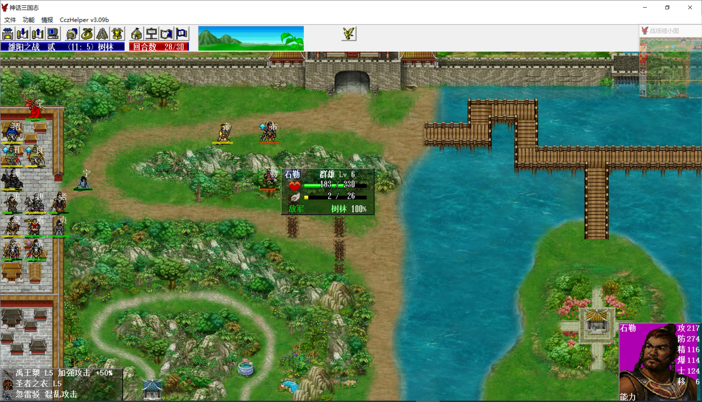

本关婴宁心控吕布2次、雷震子1次，其他人不得经验

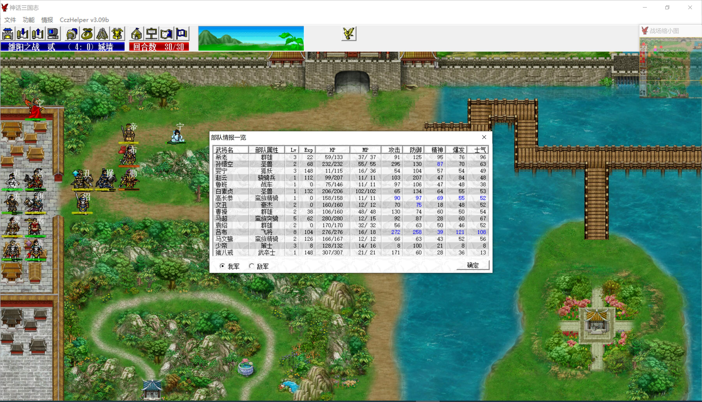
