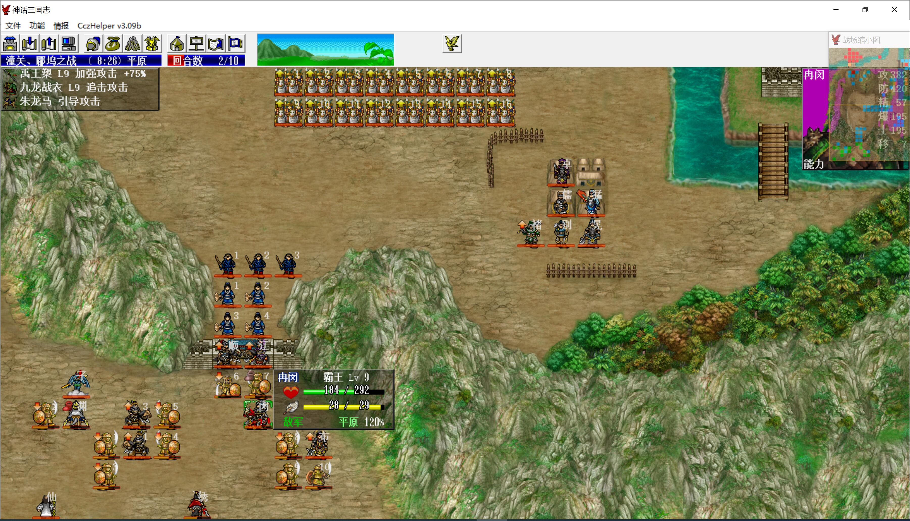

本关不带婴宁、武松，可以让敌军降1级

战前买点土雷（60）和石雷（十字，中心100，溅射90）

猴哥6级戒刀+乾坤圈，潘凤8级丈八+黄金甲+英雄榜

第一回合，猴哥腾云挑掉袁洪，穆桂英给潘凤加攻，飞燕出去埋十字雷，猴毛腾云向大部队靠近

敌军回合，赫连勃勃踩雷，猴哥被后羿和驼龙围攻

下方sl冉闵一直被吕布消耗，最好之后再中毒一直不解，掉血到喘气

谋士团多弄死几个藤甲兵，不然我军除了贾诩外，只能靠手榴弹杀了，太费钱

第二回合，猴哥秒掉后羿，引导打残上一格驼龙，潘凤穿刺带走3个

贾诩烧死被地雷炸伤的小兵，不要给他们回复的机会

飞燕继续埋土雷，猴毛继续腾云赶路

第三回合，猴哥再打残一个驼龙，潘凤穿刺带走

因为要10回合占领郿坞，回合数很吃紧，否则也不会让潘凤来收驼龙了，猴毛抓紧杀敌，他们双击率很高，sl每次都出双击

敌军清得差不多后，大部队就可以向城里撤退了

第十回合，占领郿坞，冉闵、吕布上行

第十一回合，残血冉闵进兵营休息，我军准备从小路出来，岳飞最先走，要靠他给猴毛提能力

贾诩大招直接带走冉闵、童渊和大部分连环马

剩下的人，石勒一颗手榴弹可以搞定

两个藤甲兵先用猴毛把他们定住，之后等贾诩来了再收拾，着急的话也可以用地雷手榴弹解决

雷震子被岳飞反压后就不是猴毛的对手了

吕布290hp，埋个十字雷让八戒引他，顺便帮高长恭触发特技，炸到还剩190hp时，三个猴毛一人一颗手榴弹还剩10hp，贾诩一个火可以带走

飞燕可以在张辽高顺那里练防具

本关猴哥为了杀袁洪和后羿又升了一级，穆桂英给潘凤加攻吃进10点经验，潘凤吃进两个驼龙经验，其他人不得经验

