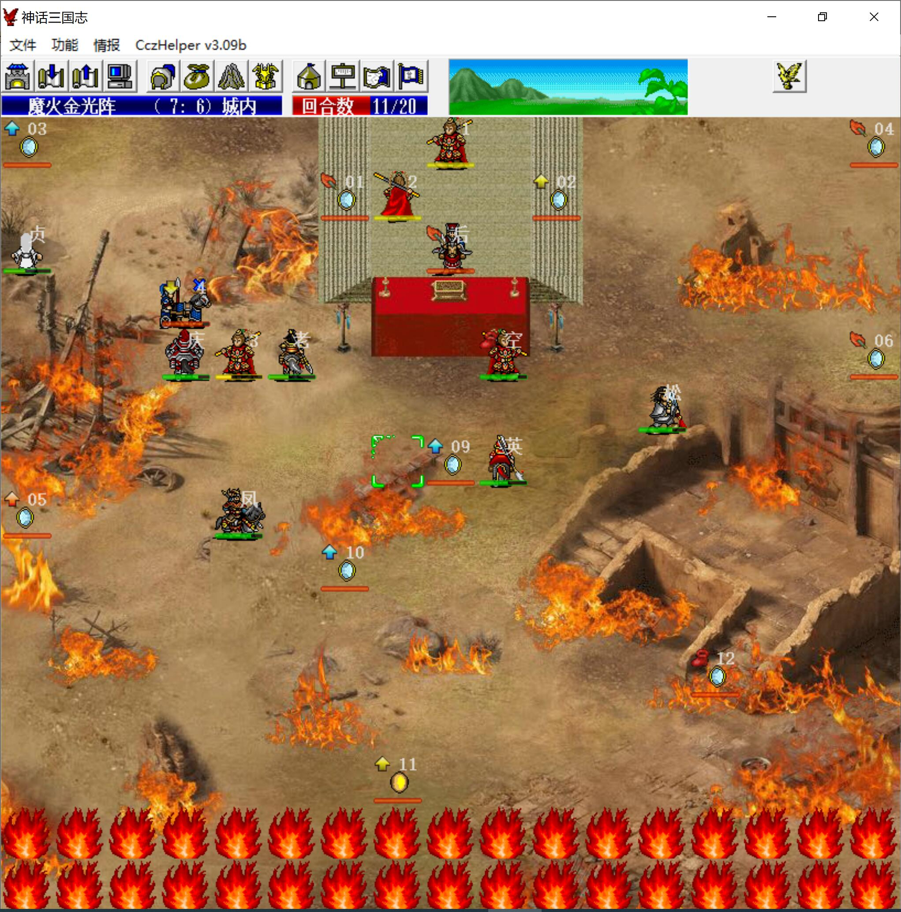

战前对话观音买10级倚天剑

本关较为简单，潘凤可以吸收所有阴阳镜的攻击，因此我军其他人毫无生存压力

唯一麻烦的是攻防+100的指南车，需要sl他们攻击猴毛时被破防，否则装店货的猴毛根本打不动他们

猴哥装6级戒刀，不带乾坤圈，穆桂英不穿防具，主角拿高级武器，为之后的R场景单挑做准备

第一回合猴哥腾云到上方召唤猴毛，城外的猴毛刷指南车，城内的刷医生

其他人不用先急着上来，防止把敌军引下来，潘凤不要走到可以反击阴阳镜的位置

敌方阶段，猴哥将左上的小兵反击残，注意不要击退他们，那样经验会多很多

第二回合，右上的一个指南车被破防，两个猴毛围攻击退，猴哥将左上的敌军往右引

之后稳扎稳打即可

第十三回合，敌军只剩风后和阴阳镜了，三个猴毛用手榴弹击退风后面前的阴阳镜

第十八回合，武松到罗宣出生点左上待机

第十九回合，潘凤下地，去（14，7）触发剧情，之后武松将戒刀乾坤圈换给猴哥，猴哥单挑风后结束

本关猴哥第一回合腾云+反击获得少许经验，其它除单挑外不得经验

