本关出圣兽猴哥，可以第一时间上山召唤猴毛

第一回合吕布、张辽清太史慈的近战，张辽注意和甘宁保持距离，高顺将甘宁引到右上角，破他的移动

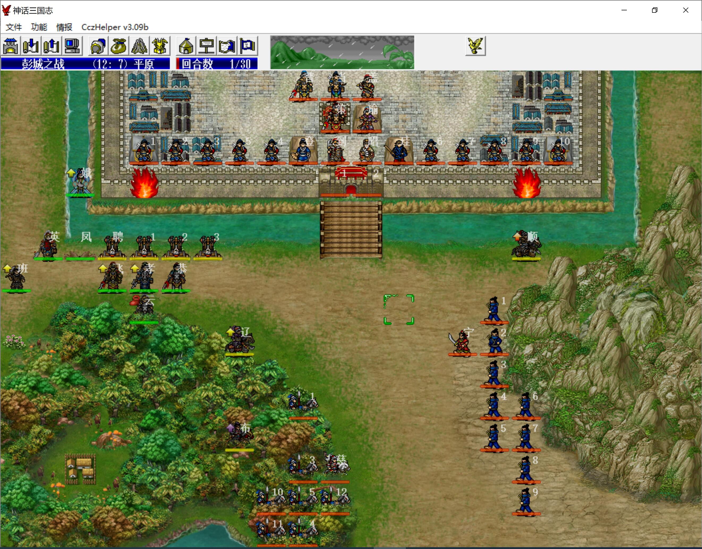

第二回合，赵云挑掉太史慈，之后吕布、张辽抓紧杀敌

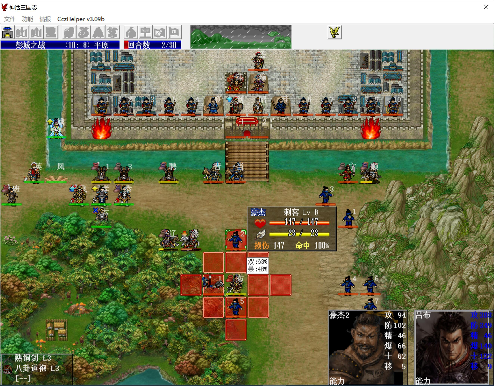

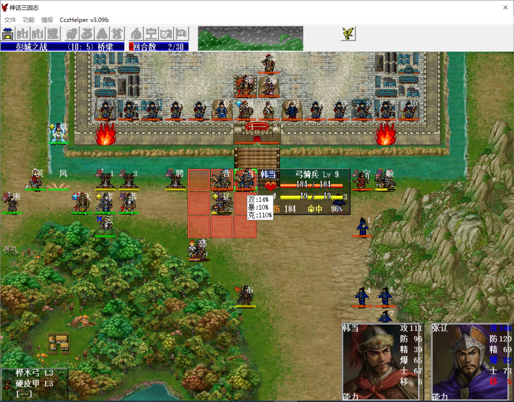

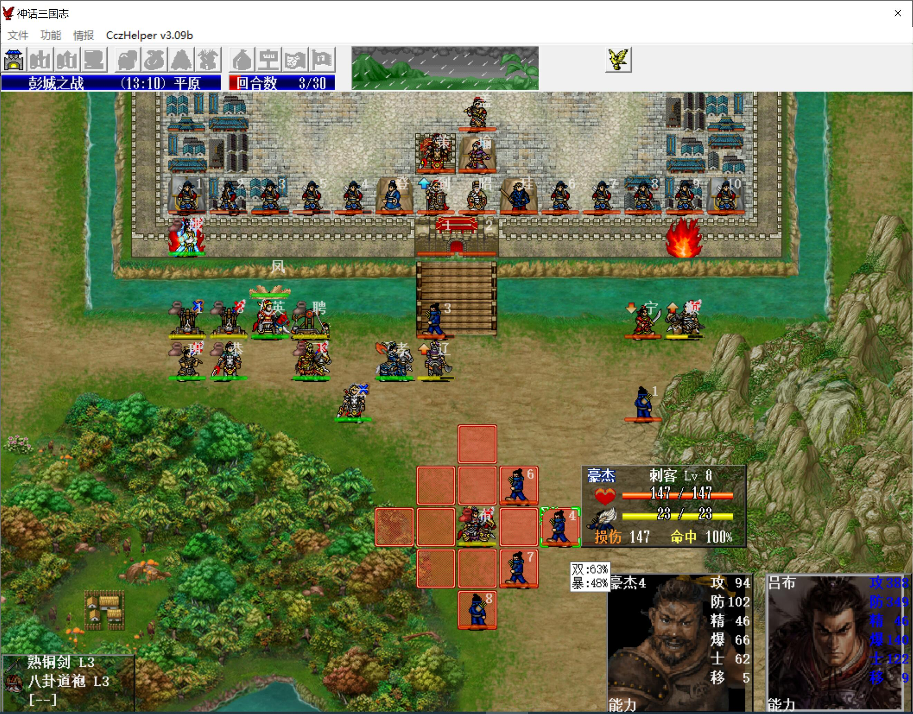

我军抓紧进城，孙策四向攻击，周瑜放法术，因此不能突击移动的先在周瑜下一格停一下，下一回合再进去

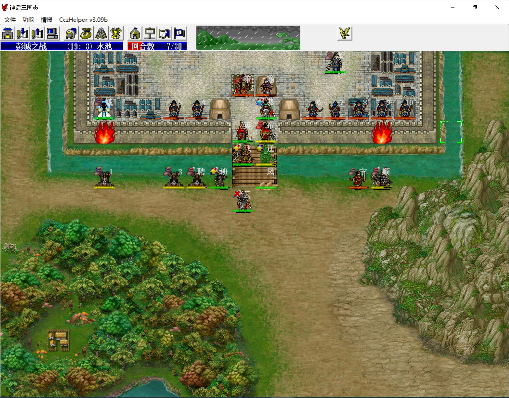

第十回合，吕布击退孙策、周瑜

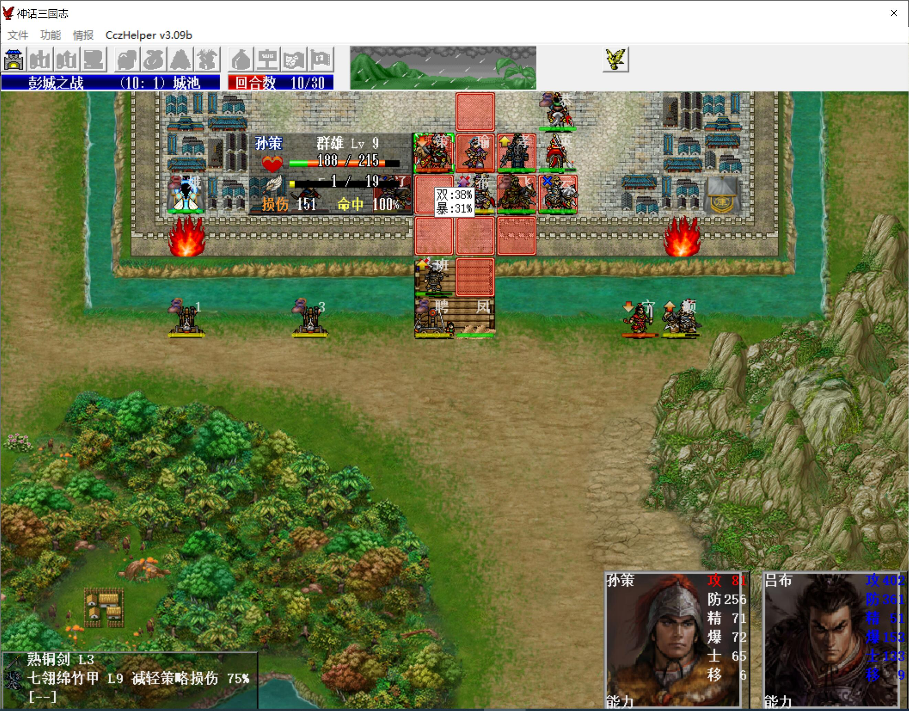

项羽出生点是（12,6），潘凤在（11,6）处埋雷即可，他肯定要左移打炮的

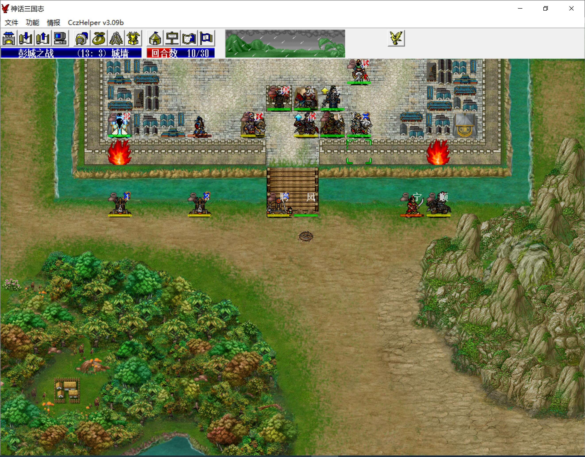

敌军阶段，项羽和他的江东子弟兵出现

第十一回合，主角、猴哥等人出现，猴哥直接去山上召唤猴毛，猴毛全部腾云下来

项羽的江东子弟兵有一部分剧本加了五围，而且还不吃地雷，不能封行动，只能硬扛……

武则天一动给西施加防，二动给自己霸气，其他人蜷缩到角落给岳云吃果子

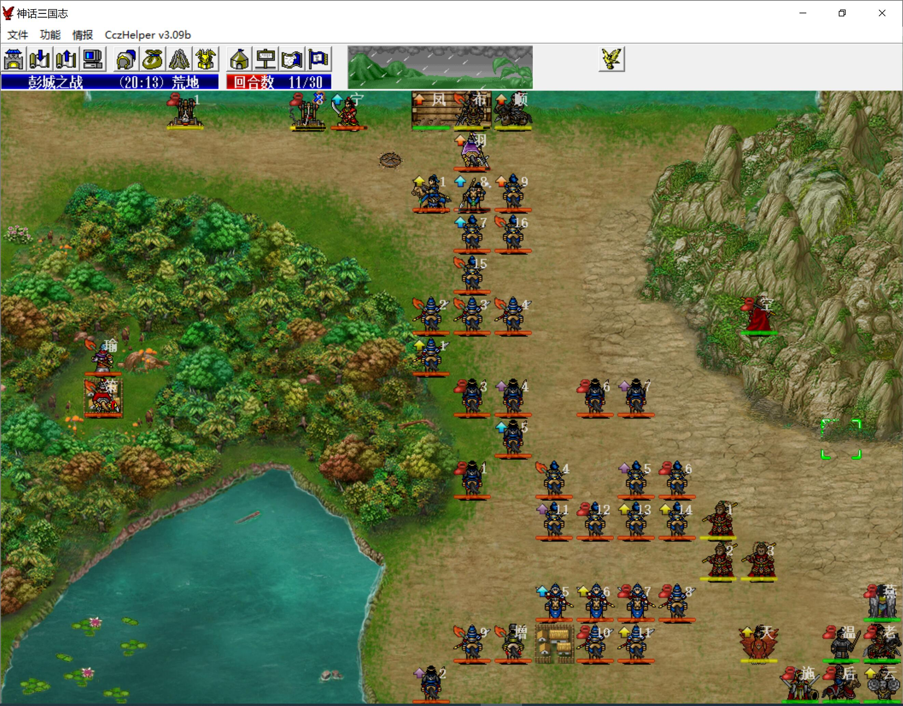

上路潘凤继续埋地雷封项羽的行动，岳飞将吕布的能力提到极限，尽快歼敌

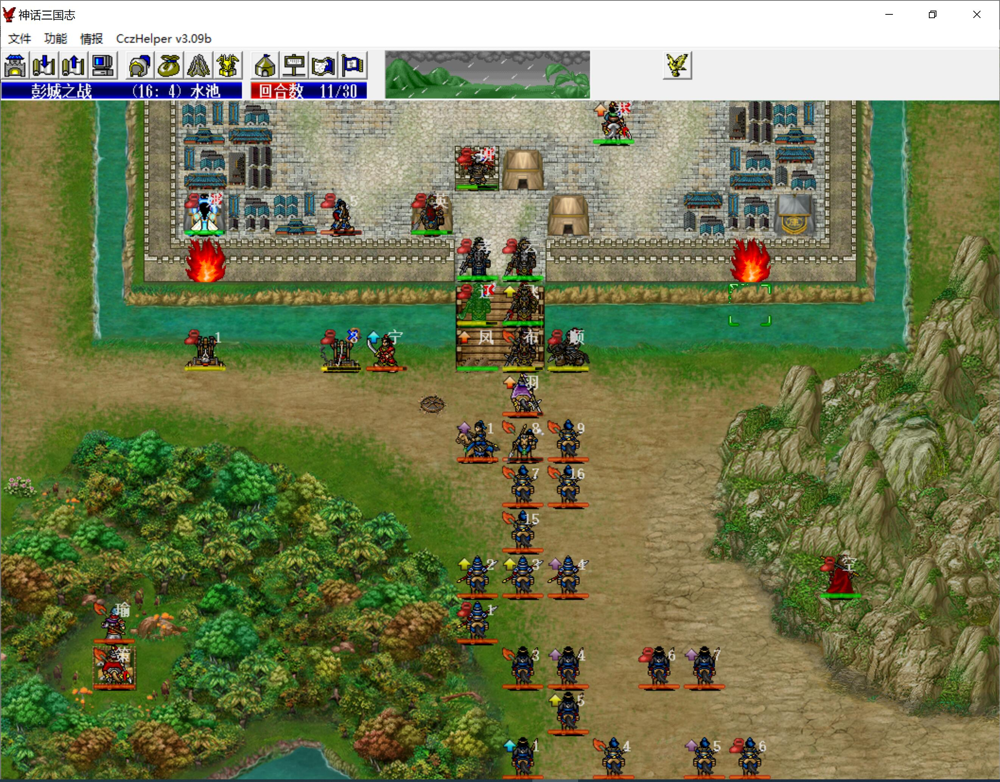

第十一回合敌军阶段，武则天要扛住两刀，sl不出暴击，出了必死

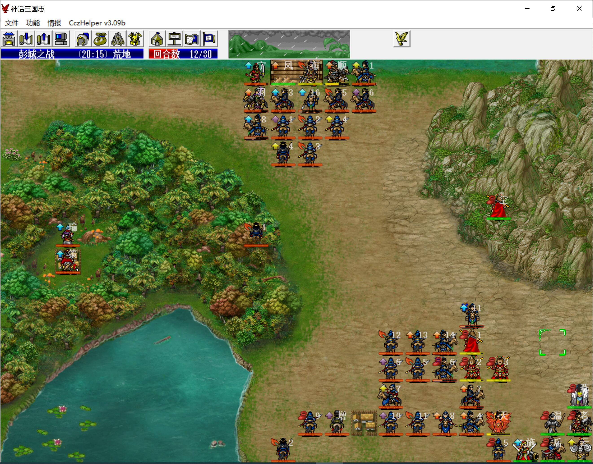

第十二回合，上路吕布奋战，注意保护好甘宁

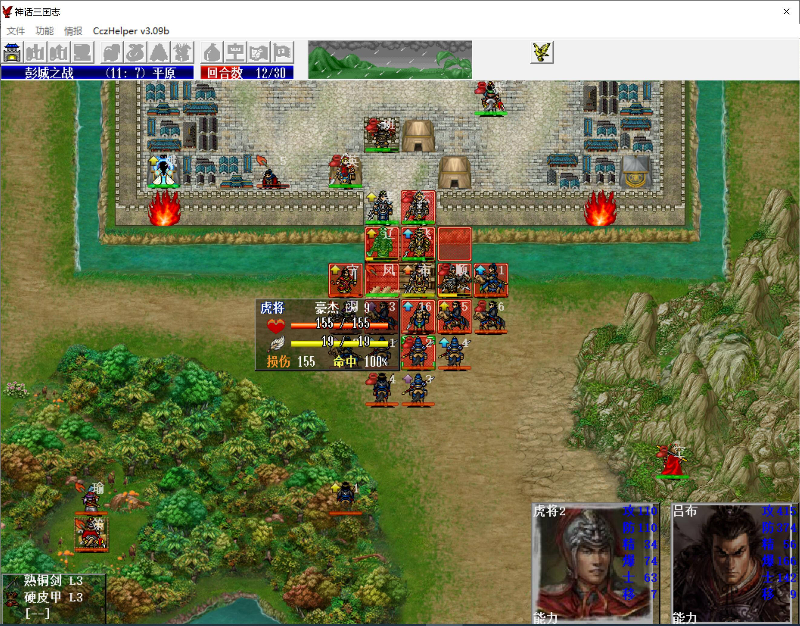

下路武则天给猴毛上群加攻，猴毛卡好位后就没难度了

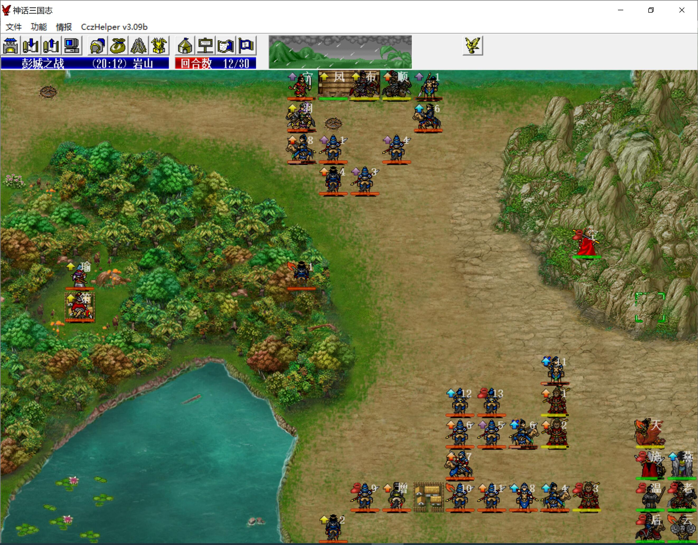

武则天上行后注意给其他人涂个经验加倍，加快练防具，当时右边应该多留几个步弓的

杀项羽是很容易的，潘凤埋雷、武则天引导即可封他行动

武则天练气化神到1血，然后换血项羽，之后随便一个友军都可击退他

如果武则天练气化神的节奏和项羽的损血节奏不搭，也可让猴毛、吕布用手榴弹控项羽的血量

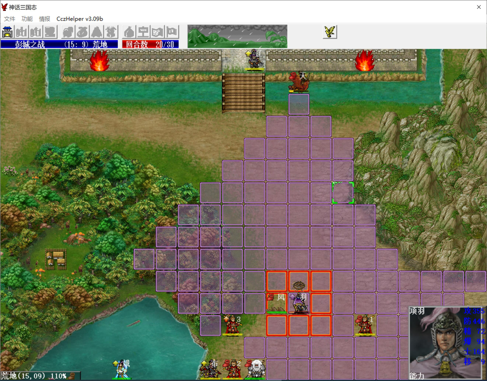

最终本关只有主角、赵云得单挑经验，其他人不得经验